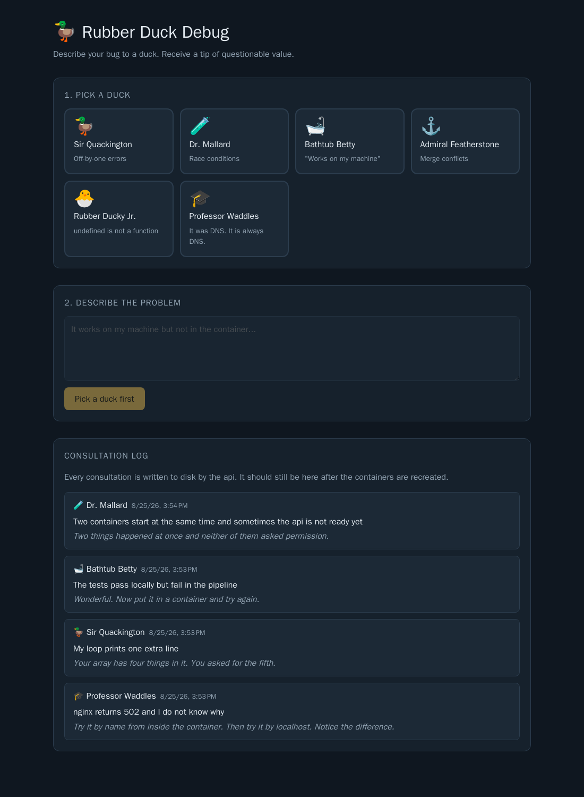

# Rubber Duck Debug

A rubber duck consultancy: pick a duck, describe your bug, and receive a
debugging tip of questionable value. Built with Angular frontend, .NET 10 minimal api
backend and both can be run with `compose.yaml`.



**This repository is broken on purpose.**  Fixing that is the workshop. The screenshot above is what it looks like when you are done.

The application code is correct and never needs to be changed. Every problem in
this repository that needs to be fixed lives in a Dockerfile or in `compose.yaml`. It's not part of the solution to edit `.cs` or `.ts` files.

## Prerequisites

- Docker Desktop (or an equivalent, e.g. Rancher Desktop / Podman Desktop)
installed, running and set to Linux containers. Compose v2 is required (for running `docker compose`).
- git and an editor. Everything here is written for PowerShell on Windows.

Check the machine prerequisites first:

```powershell
.\scripts\check-setup.ps1
```

Ports that need to be free:

| Port | Used by                                                                |
|------|------------------------------------------------------------------------|
| 8090 | `frontend` - the nginx-served app, this is the one you open in a browser |
| 8091 | `duck-api` - not published by default, see task 4                       |

<details>
<summary>Downloading the base images ahead of time</summary>

```powershell
.\scripts\prepull.ps1
```

</details>

## What is in this repository

- `duck-api`: the backend, a .NET 10 minimal api serving `/api/ducks`,
  `/api/consultations` and `/api/health`. Its Dockerfile is provided and
  contains most of the problems you are going to find.
- `duck-debug-app`: the Angular frontend. Its `Dockerfile` is an empty file,
  because writing it is task 3.
- `compose.yaml`: starts the containers together.
- `checkpoints`: The solutions from the tasks build on top of each other, so the checkpoints provide a way to jump to the next task after being stuck, see
  `checkpoints/README.md`.

## How the app is supposed to fit together

Backend (`duck-api`):

- The api listens on port 8080 inside its container and does not have to be
  published. The frontend reaches it internally over the project network.
- The api reads its tip catalogue from a file inside the container and writes
  its consultation log to `/app/data/consultations.json`. The log has to survive
  recreating the container.

Frontend (`duck-debug-app`):

- The app is served using [nginx](https://hub.docker.com/_/nginx), which
  furthermore should use the local `nginx.conf` (`duck-debug-app/nginx.conf`) in
  this repository instead of the default nginx config
  (`/etc/nginx/conf.d/default.conf`).
- The browser never talks to the api directly. Every request under `/api` is
  reverse-proxied by nginx to the backend container, so the only port the
  browser knows about is 8090.

## Commands you will need

```powershell
docker compose up --build            # build what changed, then start
docker compose up -d --build         # detached
docker compose ps                   
docker compose ps -a                
docker compose logs duck-api         
docker compose logs -f --tail 20 duck-api    # follow the logs, last 20 lines
docker compose exec duck-api sh      # open a shell inside a running container
docker compose restart duck-api
docker compose down                  # stop and remove containers and the network
docker compose down -v               # stop and also remove the volumes
docker images                     
docker volume ls
docker network ls
docker inspect duck-debug-duck-api-1 
```

## Tasks

| Task | Symptom                              | Content to practice                                 |
|------|--------------------------------------|---------------------------------------------------|
| 1    | The api image does not build         | Reading build output, sdk vs. runtime images      |
| 2    | The api container will not stay up   | `ps -a`, exit codes, logs, `WORKDIR`              |
| 3    | There is no frontend container yet   | Writing a multi-stage Dockerfile and a compose service |
| 4    | Every duck gives the same tip        | `logs` and `exec` when nothing looks broken       |
| 5    | The consultation log forgets everything | Named volumes, container vs. volume lifetime   |

If you are stuck on a task but want to continue with the next one, `.\checkpoints\apply.ps1 <current task number>` puts you at the start of the next one.

## Task 1 - The api image does not build

`docker compose up --build` doesn't build properly. The
`duck-api` build stops on a `dotnet` command that the error message claims does
not exist, even though the image is a .NET image.

Files to edit: `duck-api/Dockerfile`

<details>
<summary>Hint</summary>

Read the error to the end. It says which command it could not load, and then it
says something about SDKs. Then look at what the base image
actually contains:

```powershell
docker run --rm mcr.microsoft.com/dotnet/aspnet:10.0 dotnet --info
docker run --rm mcr.microsoft.com/dotnet/sdk:10.0 dotnet --info
```

</details>

## Task 2 - The api container will not stay up

The build succeeds now. Compose reports that it started the container, and yet:

```powershell
docker compose ps
```

shows the status `restarting`.

Files to edit: `duck-api/Dockerfile`

The published application lives in `/app` inside the image. It has to be started from there inside the container.

<details>
<summary>Hint</summary>

```powershell
docker compose ps -a
docker compose logs duck-api --tail 20
docker inspect duck-debug-duck-api-1 --format '{{.State.ExitCode}}'
```

Compare the log message with the last few lines of the Dockerfile. The first stage
sets a working directory; the second one does not, so the container starts in
`/` while the application sits somewhere else.

</details>

## Task 3 - There is no frontend container yet

`duck-debug-app/Dockerfile` is an empty file and `compose.yaml` has no frontend
service. Write a Dockerfile with Node bor the build stage and nginx fur the run stage.

Files to edit: `duck-debug-app/Dockerfile`, `duck-debug-app/.dockerignore`
(new), `compose.yaml`

- The build output must be served by [nginx](https://hub.docker.com/_/nginx),
  which should use the local `nginx.conf`
  (`duck-debug-app/nginx.conf`) instead of the default nginx config
  (so the file must be placed in `/etc/nginx/conf.d/default.conf`).
- The built image should be under 100 MB.
- The build context should only contain the files that the build needs. There is a
  `.dockerignore` in `duck-api` as a model; the frontend needs its own.
- The frontend must start together with the api and be reachable on
  <http://localhost:8090/>.
- Use an alpine nginx image.
- The Angular application builder writes its output to
  `dist/<project name>/browser`. The project name is `duck-debug-app`.
- `npm ci` needs both `package.json` **and** `package-lock.json`.

The base images you need are
[node:24-alpine](https://hub.docker.com/_/node) to build with and
[nginx:1.31-alpine](https://hub.docker.com/_/nginx) to serve with. nginx serves whatever is placed on `/usr/share/nginx/html` by default.


## Task 4 - Every duck gives the same tip

All six ducks say exactly the same
thing, but they are supposed to have their own opinions. There are no error messages in the logs, but there is a warning.

Files to edit: `duck-api/Dockerfile`

<details>
<summary>Hint</summary>

```powershell
docker compose logs duck-api
```

There is a `warn` in there that names a path. Then go and look inside the running
container to see whether that path exists:

```powershell
docker compose exec duck-api ls -l /app
docker compose exec duck-api env | Select-String DUCKPOND
```

</details>

## Task 5 - The consultation log forgets everything

Consult a few ducks, then run:

```powershell
docker compose down
docker compose up -d
```

The log is now empty. Anything that replaces the container loses the
log, because the logs are only stored within the container storage that gets removed together with the container.

Files to edit: `compose.yaml`

- The consultation log lives in `/app/data` inside the api container and has to
  survive recreating and rebuilding that container.
- It should not depend on a path that
  only exists on your machine.
- Afterwards `docker compose down` followed by `docker compose up -d` keeps the
  log, and `docker compose down -v` clears it on purpose.

<details>
<summary>Hint</summary>

```powershell
docker volume ls
docker compose exec duck-api ls -l /app/data
docker inspect duck-debug-duck-api-1 --format '{{json .Mounts}}'
```

A container's writable layer is created with the container and deleted with it.
A Volume is managed separately and can hold the data.

</details>

## If you get stuck

`.\checkpoints\apply.ps1 <task number>` moves you to the start of the next task.
To throw away everything you changed and get the original state back:

```powershell
git restore .
git clean -fd
```
